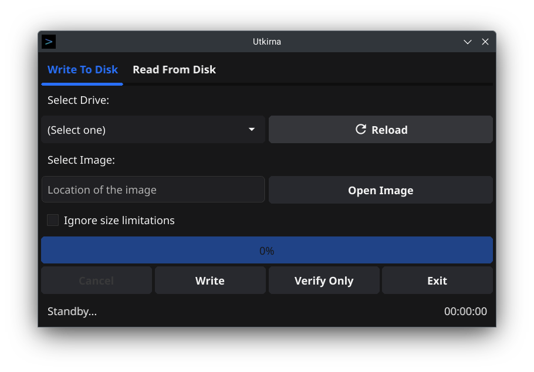

# Utkirna

<p align="center">
  
</p>

## About
Utkirna is a cross-platform application heavily inspired from [Win32DiskImager](https://sourceforge.net/projects/win32diskimager/) that lets you to write a raw disk image to a removable device or backup a removable device to a raw image file. It is useful for preparing bootable drives with "dd like" images for PC, SBC and embedded development boards as well for backing up such drives.
Utkirna (devanagari: उत्कीर्ण, romanized: Utkīrṇa) means "engraved" in Sanskrit.

## Downloads
Visit the [release page](https://github.com/arnavbhatt288/utkirna/releases) to download the latest release. Pre-built binaries are available for Linux and Windows (both x86-64) for now.

## Requirements
As Utkirna compiles into a statically linked binary, there are no runtime dependency requirements. For compiling, a [Go](https://go.dev/) compiler (version 1.18 or later) and the [prerequisites for Fyne](https://developer.fyne.io/started/) is required.

## Building
Systems with the compile-time requirements satisfied can build the project using `go build` in the project root:
```bash
go build
```
Compilation can also be performed with fyne for including the [fyne metadata](https://developer.fyne.io/started/metadata/). Use the following command in the project root:
```bash
fyne build
```
## Contributing
Contributions are highly appreciated. Everything from creating bug reports to contributing code will help the project to a great degree, so feel free to help in any manner you prefer to.

## Licnese
Utkirna is licensed in `0BSD` as every software licenses is a complete meme anyway.
